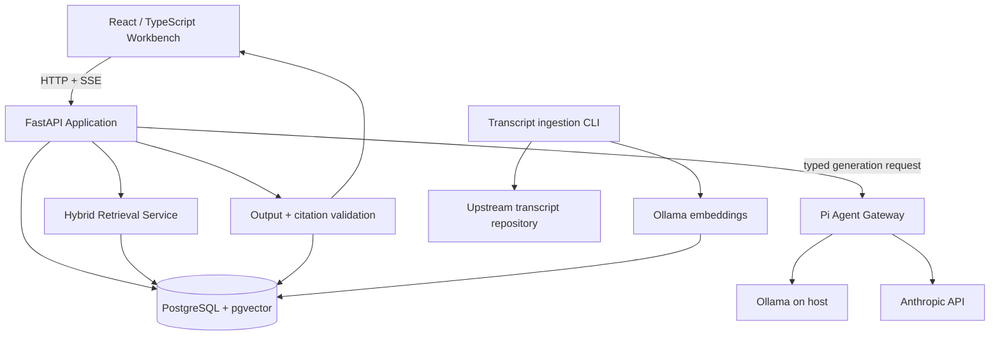

# The Lenny Growth Assistant — Full Implementation Specification

**Version:** 1.0 implementation baseline  
**Date:** 9 October 2026  
**Deadline in assignment:** 12 October 2026, end of day IST  
**Primary IDE:** Google Antigravity, supervised autonomy  
**Product differentiator:** The Growth Workbench  
**Visual direction:** Editorial Research Studio

This document is the canonical implementation plan. The take-home assignment remains the external contract and overrides this document if a direct conflict is discovered. Record any such conflict in an ADR; do not silently discard a requirement.

---

## 1. Product definition

### 1.1 Product thesis

Build an evidence-first product and growth workspace that turns knowledge from Lenny's Podcast transcripts into decisions, publishable writing, and rendered deliverables.

The core experience is not four unrelated buttons. It is one connected journey:

**Research → Decide → Create → Refine and export.**

The primary persona is a product manager or growth lead at a startup or technology company. Marketing professionals and founders are secondary natural users. They care about useful answers and clear deliverables, not prompts, retrieval configuration, SDKs, or infrastructure.

### 1.2 Product promise

“Go from expert insight to a usable growth deliverable—with traceable sources.”

Do not promise guaranteed growth outcomes, universal correctness, or replacement of customer research. The product helps users discover, synthesize, and apply expert knowledge; users remain responsible for decisions and real-world validation.

### 1.3 Signature feature: Growth Brief

The Growth Brief is a persisted structured deliverable derived from a conversation, not a workflow engine or project-management system. It connects research to the next output. Its version 1 shape is:

1. **Problem:** target user, challenge, desired outcome, and known constraints.
2. **Research and evidence:** source-grounded synthesis with references to exact transcript chunks.
3. **Recommendation:** a reasoned proposal and its assumptions/limitations.
4. **Experiment:** hypothesis, proposed change, audience, primary metric, guardrail metric, and decision rule.
5. **Next deliverable:** optional essay, strategy memo, or rendered artifact generated from the brief.

The user may enter one optional free-text product-context field when building a Growth Brief. It may describe product stage, target customer, current goal, constraints, and metrics. It is not required for ordinary questions. The UI and agent must distinguish:

- transcript-backed evidence;
- user-provided context;
- assistant synthesis or recommendation.

Never attribute user-supplied facts to podcast guests.

### 1.4 Main workflows

- **Ask & Research:** answer a product/growth question using only retrieved transcript evidence. Preserve conversational context and surface source citations.
- **Build a Growth Plan:** create/save a Growth Brief from research, with optional product context.
- **Create Content:** generate a Ship 30 for 30-style essay or other source-grounded written deliverable.
- **Create Artifact:** create a Markdown document or HTML/CSS artifact and preview it within the app.
- **Refine and export:** revise text/artifacts, inspect supporting sources, copy or download the output, and reopen persisted sessions/artifacts.

### 1.5 Design direction

Editorial Research Studio, adapted for growth/marketing teams:

- warm off-white/ivory canvas, ink-colored text, and one restrained terracotta/rust accent;
- editorial serif display headings paired with highly readable sans-serif body text;
- clear hierarchy, generous whitespace, quiet session navigation, readable evidence cards;
- output-first artifact panel with preview first and code view secondary;
- user-facing language, not developer jargon, in the default UI;
- technical provider status visible but not dominant; detailed diagnostics belong in an optional panel.

Suggested tokens to start with (adjust after browser review):

```css
--canvas: #F7F4ED;
--surface: #FFFEFB;
--ink: #242A2E;
--muted-ink: #686D6B;
--accent: #B65E45;
--accent-soft: #F2E2DA;
--border: #E4DED4;
--success: #466A58;
--danger: #A43F35;
```

Do not optimize for a dark developer console. Do not use loud gradients, random dashboard charts, fake metrics, or generic “AI blue/purple glow” styling. Use a small consistent visual system rather than decorative complexity.

---

## 2. Requirements and scope

### 2.1 Mandatory requirements — cannot be cut

- FastAPI backend.
- Agent layer uses either the Claude Agent SDK or Pi Coding Agent.
- New chats work; separate sessions never share context.
- PostgreSQL stores sessions, messages/conversations, timestamps, and user metadata.
- Defined API request/response contracts, validation, structured errors, health endpoints.
- At least one cloud LLM provider and Ollama local inference; Ollama must be shown in the demo.
- Provider is visible to the user; no code change is needed to switch; fallback behavior is documented.
- Transcript ingestion using `https://github.com/ChatPRD/lennys-podcast-transcripts`.
- Ingestion documentation covers loading, chunking, indexing, refreshing, and traceability.
- Grounded answers cite/identify relevant source passages and admit when the corpus is insufficient.
- Follow-up questions use the current session's history.
- Dedicated Ship 30 for 30 skill based on the linked guide, not only an improvised prompt. Essay target is approximately 1,250 words with a hook, coherent narrative, skimmable formatting, practical takeaway, and podcast-grounded claims.
- Markdown and complete HTML/CSS artifacts render natively beside the chat.
- Generated HTML is treated as untrusted and previewed with isolation and restrictive policy.
- One-command practical startup, `.env.example` with safe defaults, structured logs, graceful failures, handoff documentation.
- Public GitHub repository with no secrets; `README.md`, `PRD.md`, `design.md`, `architecture.md`, agent transcripts, automated tests, manual UI test plan, and 2–3 minute camera-on demo uploaded to YouTube.

### 2.2 Prioritized extras

**P1, target after mandatory flows are end-to-end:** Growth Brief; source inspector; split-pane artifact viewer; streaming status/progress; copy/download; retrieval/grounding evaluation set; optional product context; clear model status; retry/cancel behavior.

**P2, only after all required acceptance gates pass:** comparison of expert perspectives; artifact version restore UI; optional technical diagnostics; additional templates.

### 2.3 Explicit non-goals for version 1

- Multi-tenant production SaaS, billing, SSO, team roles, or elaborate auth system.
- A project-management system, collaboration editor, Figma replacement, or general analytics suite.
- Arbitrary shell/file tools for the product agent.
- Distributed queues, Redis, microservices beyond the selected agent runtime requirement, or a separate vector database.
- Unbounded autonomous agents or a multi-agent swarm.
- Silent routing from local to cloud.

Scope boundaries are not permission to skip mandatory requirements. Expand implementation work with the AI IDE, but do not add systems without a demonstrated need.

---

## 3. Architecture and key decisions

### 3.1 Default stack

**Frontend**
- React + TypeScript + Vite.
- Tailwind CSS with a small, explicit design-token layer.
- Accessible component primitives (shadcn/ui/Radix are acceptable if used deliberately) and `lucide-react` icons.
- Fetch API for backend requests; a tested SSE parser over `fetch()` if POST streaming is used.
- Markdown renderer with HTML disabled/escaped by default; vetted link handling; no raw HTML in the parent DOM.

**API and data services**
- Python 3.12+ (use the supported version available in the environment and pin it) + FastAPI + Pydantic settings/schemas.
- SQLAlchemy 2.x async ORM, Alembic migrations, PostgreSQL with pgvector.
- PostgreSQL is the persistent application source of truth.
- Full-text search via PostgreSQL `tsvector` and semantic retrieval via pgvector; combine candidates in the application.

**Agent runtime**
- Start with **Pi Coding Agent SDK in a small TypeScript/Node gateway**, using its documented configurable OpenAI-compatible endpoint for Ollama and the built-in Anthropic provider for cloud inference.
- Keep the gateway thin: no application database ownership, no independent authoritative chat history, no business permissions, no general-purpose shell/filesystem tools.
- The gateway accepts a typed generation request and returns a typed result plus status/stream events. FastAPI owns session access, retrieval, citation validation, persistence, and final error semantics.
- Pi SDK sessions may be ephemeral per run. Pass only the current authorized session's bounded conversation context. PostgreSQL remains authoritative.

**Why this default:** current Pi documentation describes in-process TypeScript SDK integration and configuration of compatible Ollama endpoints, alongside its provider/model configuration. Claude Agent SDK officially runs the Claude Code agent harness; an open issue dated 31 July 2026 reports certain Ollama models outputting tool calls as text instead of structured tool blocks through the SDK/CLI. That report does not prove every combination fails, but it makes the Python-only path a risk to validate rather than assume.

**Time-boxed simplification test:** During Phase 0 only, it is acceptable to test Claude Agent SDK in Python against the chosen Ollama model. Switch to a single-process Python implementation only if, within 45 minutes, it passes all required checks: local response, correct structured result, any required tool call, clean cloud-provider call, per-request provider isolation, cancellation/timeout handling, and no unsafe mutation of process-global environment in concurrent requests. Record evidence in an ADR. If it does not pass, use the Pi gateway and stop revisiting the choice. Do not build both production paths.

**No multiple autonomous agents.** Use one agent runtime, explicit app workflows, narrowly scoped skills, and deterministic FastAPI orchestration. This is easier to test and is enough to satisfy the required agent integration.

### 3.2 Model configuration

Provider enum:

- `local` → Ollama host URL + configured local chat model.
- `cloud` → Anthropic API + configured cloud model.

Never accept an arbitrary API base URL or secret from the browser. Browser sends a provider enum. Backend maps it to allowlisted configuration. A requested model override is allowed only if its ID is in server configuration.

Suggested `.env.example` values:

```dotenv
APP_ENV=development
APP_LOG_LEVEL=INFO
APP_BASE_URL=http://localhost:5173
API_PORT=8000
AGENT_GATEWAY_PORT=8010
DATABASE_URL=postgresql+asyncpg://lenny:lenny_dev_only@db:5432/lenny_growth
DEMO_USER_ID=00000000-0000-4000-8000-000000000001
OLLAMA_BASE_URL=http://host.docker.internal:11434
OLLAMA_CHAT_MODEL=qwen3:4b
OLLAMA_EMBEDDING_MODEL=embeddinggemma
EMBEDDING_DIMENSIONS=768
DEFAULT_PROVIDER=local
ANTHROPIC_API_KEY=
ANTHROPIC_MODEL=claude-sonnet-latest
AGENT_GATEWAY_URL=http://agent-gateway:8010
INTERNAL_SERVICE_TOKEN=replace-with-a-local-random-value
RETRIEVAL_TOP_K=8
RETRIEVAL_MIN_SCORE=0.25
MAX_CONTEXT_MESSAGES=12
GENERATION_TIMEOUT_SECONDS=120
```

These are example names/defaults, not a promise that every latest model tag will remain available. Pin/verify selected provider/model IDs during Phase 0 and document the exact tested values. Do not make `ANTHROPIC_API_KEY` required for local mode. Do not commit `.env`.

The model `qwen3:4b` is only a starting candidate for a machine with a 4 GB GPU / 16 GB RAM; run the actual model smoke test and choose a model that fits and performs acceptably. Never claim GPU utilization without checking Ollama's runtime. `embeddinggemma` is the default embedding candidate; verify output dimension is 768 before relying on `vector(768)`. Use the same embedding model/version and dimension for indexing and querying. Changing embedding models requires re-embedding all active chunks and an intentional schema/index transition.

### 3.3 Request routing

FastAPI validates the mode explicitly:

- `research`
- `growth_brief`
- `essay`
- `artifact_markdown`
- `artifact_html`

Natural-language intent detection may suggest or default a mode, but the UI must provide deterministic mode actions. Do not rely entirely on a local model's implicit classification. All modes share persistence, retrieval/source validation, provider policy, and observability.

### 3.4 Architecture diagram



---

## 4. Repository structure

Use a clean monorepo:

```text
lenny-growth-assistant/
├── frontend/
│   ├── src/
│   │   ├── app/                 # routes, layout, providers
│   │   ├── components/          # shared accessible UI primitives
│   │   ├── features/
│   │   │   ├── sessions/
│   │   │   ├── conversation/
│   │   │   ├── evidence/
│   │   │   ├── growth-brief/
│   │   │   ├── content/
│   │   │   └── artifacts/
│   │   ├── lib/api/              # typed API client and SSE parser
│   │   ├── styles/               # design tokens and app CSS
│   │   └── tests/
│   ├── Dockerfile
│   └── package.json
├── backend/
│   ├── app/
│   │   ├── main.py
│   │   ├── config.py
│   │   ├── api/v1/               # routers and schemas
│   │   ├── core/                 # logging, errors, request IDs
│   │   ├── db/                   # models, sessions, migrations integration
│   │   ├── services/              # session, message, brief, artifact, provider
│   │   ├── retrieval/             # embeddings, keyword, vector, ranking
│   │   ├── ingestion/             # sync, parse, chunk, index
│   │   ├── agent_client/          # typed gateway client, skill loader, prompts
│   │   └── security/              # artifact preview policy and validators
│   ├── migrations/
│   ├── tests/unit/
│   ├── tests/integration/
│   └── pyproject.toml
├── agent-gateway/
│   ├── src/server.ts
│   ├── src/config.ts
│   ├── src/schemas.ts
│   ├── src/runtime/pi-runtime.ts
│   ├── src/providers.ts
│   ├── src/skills.ts
│   ├── src/logging.ts
│   ├── tests/
│   └── package.json
├── runtime-skills/
│   └── ship-30-for-30/SKILL.md
├── scripts/
│   ├── bootstrap.sh
│   ├── bootstrap.ps1
│   ├── demo.sh
│   ├── demo.ps1
│   └── fresh-clone-check.sh
├── docs/
│   ├── PRD.md
│   ├── design.md
│   ├── architecture.md
│   ├── manual-test-plan.md
│   ├── ADRs/
│   └── evaluation/
├── agent-transcripts/            # genuine, sanitized logs; no secrets
├── .agents/skills/               # IDE skills/rules, separate from app runtime skills
├── .env.example
├── .gitignore
├── docker-compose.yml
├── Makefile
├── README.md
└── IMPLEMENTATION_SPEC.md
```

Keep upstream transcripts and downloaded model files out of the repository. Clone/sync transcript content into a local Docker volume or an ignored data directory. The source repo's README currently describes 269 transcripts and YAML frontmatter; do not hard-code 269 as the expected count. Report the count discovered at ingestion time and preserve the upstream commit/hash. Verify repository licensing/redistribution conditions before copying any transcript text into the public app repository; the public repo should contain ingestion code, not a vendored transcript dump.

---

## 5. Data model

Use UUID primary keys, UTC timestamps, foreign keys, indexes, constraints, and Alembic migrations. JSONB is acceptable for flexible metadata but not as an excuse to store every relationship in one opaque blob.

### 5.1 `users`

- `id UUID PRIMARY KEY`
- `display_name TEXT NOT NULL`
- `email TEXT NULL` (only if useful; not a required auth feature)
- `metadata JSONB NOT NULL DEFAULT '{}'`
- `created_at TIMESTAMPTZ NOT NULL`

For the local take-home, seed one demo user from config. Do not imply this is a complete public multi-user authentication implementation. Do not trust a user ID supplied freely by the browser.

### 5.2 `chat_sessions`

- `id UUID PRIMARY KEY`
- `user_id UUID NOT NULL REFERENCES users(id)`
- `title TEXT NOT NULL` (derive from first user message; editable if implemented)
- `provider_preference TEXT NOT NULL CHECK IN ('local','cloud')`
- `created_at`, `updated_at`, `last_message_at` as UTC timestamps
- `metadata JSONB NOT NULL DEFAULT '{}'`

Every session query must enforce the current app user/owner. A UUID is not authorization.

### 5.3 `messages`

- `id UUID PRIMARY KEY`
- `session_id UUID NOT NULL REFERENCES chat_sessions(id) ON DELETE CASCADE`
- `role TEXT NOT NULL CHECK IN ('user','assistant')`
- `content TEXT NOT NULL DEFAULT ''`
- `status TEXT NOT NULL CHECK IN ('pending','complete','failed','cancelled')`
- `workflow_mode TEXT NULL`
- `provider TEXT NULL CHECK IN ('local','cloud')`
- `model_id TEXT NULL`
- `error_code TEXT NULL`
- `metadata JSONB NOT NULL DEFAULT '{}'`
- `created_at`, `completed_at` as UTC timestamps

Insert a pending assistant record before a long generation if needed. Only set `complete` after output and citations validate and the final transaction commits. Never store partial stream fragments as a completed answer. Failed user messages may remain in history, but errors should be represented clearly and not contain secrets.

### 5.4 `transcript_sources`

- `id UUID PRIMARY KEY`
- `source_key TEXT NOT NULL UNIQUE` (stable path/slug based on repository relative path)
- `guest TEXT NULL`
- `title TEXT NOT NULL`
- `episode_url TEXT NULL`
- `video_id TEXT NULL`
- `publish_date DATE NULL`
- `description TEXT NULL`
- `upstream_path TEXT NOT NULL`
- `content_hash TEXT NOT NULL`
- `repo_commit TEXT NULL`
- `is_active BOOLEAN NOT NULL DEFAULT TRUE`
- `ingested_at TIMESTAMPTZ NOT NULL`

Do not generate episode URLs from guessed patterns. Use the source metadata. Handle absent metadata gracefully.

### 5.5 `transcript_chunks`

- `id UUID PRIMARY KEY`
- `source_id UUID NOT NULL REFERENCES transcript_sources(id) ON DELETE CASCADE`
- `chunk_index INTEGER NOT NULL`
- `content TEXT NOT NULL`
- `content_hash TEXT NOT NULL`
- `char_start INTEGER NULL`, `char_end INTEGER NULL`
- `embedding VECTOR(768) NOT NULL` after the embedding smoke test confirms 768 dimensions
- `search_vector TSVECTOR NOT NULL`
- `created_at TIMESTAMPTZ NOT NULL`
- `UNIQUE(source_id, chunk_index)`

Index vector search using the appropriate pgvector index/opclass for the deployed extension and chosen distance. Index `search_vector` with GIN. For small corpora exact vector search may be fine initially; add HNSW/IVFFlat only if latency/corpus size justifies it and after validating planner behavior.

### 5.6 `message_sources`

Join table linking an assistant message to a real source chunk:

- `message_id UUID REFERENCES messages(id) ON DELETE CASCADE`
- `chunk_id UUID REFERENCES transcript_chunks(id)`
- `evidence_id TEXT NOT NULL` (per-run labels such as `E1`, `E2`; unique within one answer, not globally)
- `supports TEXT NULL` (brief claim/section label; model-generated text is untrusted and never the source quote)
- `retrieval_rank INTEGER NOT NULL`
- `semantic_score DOUBLE PRECISION NULL`
- `keyword_score DOUBLE PRECISION NULL`
- composite primary key `(message_id, chunk_id)`

The UI excerpt must be read from `transcript_chunks.content`, not trusted generated quote text.

### 5.7 `growth_briefs`

- `id UUID PRIMARY KEY`
- `session_id UUID NOT NULL REFERENCES chat_sessions(id)`
- `source_message_id UUID NULL REFERENCES messages(id)`
- `title TEXT NOT NULL`
- `version INTEGER NOT NULL DEFAULT 1`
- `status TEXT NOT NULL CHECK IN ('draft','ready','archived')`
- `product_context TEXT NULL`
- typed structured JSONB for `problem`, `research_summary`, `recommendation`, `assumptions`, `experiment`, `success_metrics`, `risks`, `next_deliverable`
- `created_at`, `updated_at` UTC timestamps

Validate the JSONB document with Pydantic before write/read. Use optimistic version checks if edit/restore is implemented. Don't build a full visual workflow engine.

### 5.8 `artifacts`

- `id UUID PRIMARY KEY`
- `session_id UUID NOT NULL REFERENCES chat_sessions(id)`
- `source_message_id UUID NULL REFERENCES messages(id)`
- `growth_brief_id UUID NULL REFERENCES growth_briefs(id)`
- `kind TEXT NOT NULL CHECK IN ('markdown','html')`
- `title TEXT NOT NULL`
- `content TEXT NOT NULL` (the exact authored source/output)
- `preview_content TEXT NULL` (sanitized preview representation if stored; must be derived server-side)
- `version INTEGER NOT NULL DEFAULT 1`
- `created_at`, `updated_at` UTC timestamps

If artifact revision history fits, add an `artifact_versions` table with immutable versions. Otherwise retain one incrementing version and don't claim history/restore exists. Never persist user edits silently over another version; use version checks.

### 5.9 Optional `generation_runs`

Add only if needed for lifecycle/debugging. Useful fields: `id`, `session_id`, `user_message_id`, `assistant_message_id`, `mode`, `provider`, `model_id`, `status`, `started_at`, `finished_at`, `latency_ms`, `retrieved_count`, `error_code`, and redacted `metadata`. Do not log full prompt or transcript by default.

---

## 6. API contracts

Prefix routes with `/api/v1`. Use UUID path validation and Pydantic request/response models. Return consistent error bodies. Do not return raw stack traces to the browser.

### 6.1 Error envelope

```json
{
  "error": {
    "code": "PROVIDER_UNAVAILABLE",
    "message": "The selected local model is unavailable. Start Ollama or choose the cloud provider.",
    "retryable": true,
    "request_id": "uuid"
  }
}
```

Define a stable exception mapping for validation errors, missing session, provider unavailable, generation timeout, retrieval unavailable, insufficient evidence (this is a valid assistant result, not necessarily an HTTP error), persistence failure, artifact validation, and internal error.

### 6.2 Required endpoints

- `GET /api/v1/health/live` — process is alive; no deep network calls.
- `GET /api/v1/health/ready` — verifies required dependencies such as DB; returns component readiness without leaking secrets. Local/cloud provider readiness can be reported separately rather than making the entire app unready when optional cloud credentials are absent.
- `GET /api/v1/config` — public UI-safe config only: available provider options, configured model display names, default provider, and feature availability. Never return API keys or internal URLs.
- `GET /api/v1/providers` — status of local/cloud providers, checked with short timeouts; provider unavailable must not block the whole UI. Must not trigger an implicit switch.
- `POST /api/v1/sessions` — create session. Body can include optional title and provider preference. Response returns ID and timestamps.
- `GET /api/v1/sessions` — list sessions for current app user, most recently active first.
- `GET /api/v1/sessions/{session_id}` — get session metadata; enforce ownership.
- `GET /api/v1/sessions/{session_id}/messages` — paginated chronological history. Completed assistant messages include validated source references.
- `DELETE /api/v1/sessions/{session_id}` — optional QoL; cascade safely and require ownership.
- `POST /api/v1/sessions/{session_id}/messages` — submit user message and workflow request, optionally using SSE.
- `GET /api/v1/sources/{source_id}` — source metadata and episode URL.
- `GET /api/v1/chunks/{chunk_id}` — return a chunk excerpt for evidence inspection only after session/source policy checks; avoid exposing unrelated arbitrary data.
- `GET /api/v1/growth-briefs/{brief_id}` and `PATCH /api/v1/growth-briefs/{brief_id}` — retrieve/update typed structured brief with ownership/version check.
- `GET /api/v1/artifacts/{artifact_id}` and `PATCH /api/v1/artifacts/{artifact_id}` — retrieve/save artifact with ownership/version check.
- Optional `GET /api/v1/ingestion/status` for sync progress and latest commit/hash summary.

### 6.3 Message request

```json
{
  "content": "How can an early-stage SaaS improve activation without harming retention?",
  "mode": "research",
  "provider": "local",
  "artifact_format": null,
  "product_context": null
}
```

`mode` enum: `research | growth_brief | essay | artifact_markdown | artifact_html`. `provider` enum: `local | cloud`. `artifact_format` is required only if needed by artifact modes; reject unsupported combinations. Enforce a reasonable maximum content/context length. Strip or reject null bytes and invalid control characters; do not over-normalize content in a way that changes meaning.

`product_context` is optional and limited (e.g. 4,000 characters). Never require it for ordinary research.

### 6.4 Completed message response

```json
{
  "message": {
    "id": "uuid",
    "session_id": "uuid",
    "role": "assistant",
    "status": "complete",
    "content": "The answer with a validated citation marker [E1].",
    "mode": "research",
    "provider": "local",
    "model_id": "qwen3:4b",
    "created_at": "2026-10-09T12:00:00Z"
  },
  "citations": [
    {
      "evidence_id": "E1",
      "source_id": "uuid",
      "chunk_id": "uuid",
      "guest": "Source guest",
      "episode_title": "Canonical episode title",
      "episode_url": "https://...",
      "publish_date": "2024-01-01",
      "excerpt": "Exact excerpt loaded from the source chunk.",
      "supports": "Claim/section this passage supports"
    }
  ],
  "insufficient_evidence": false,
  "growth_brief_id": null,
  "artifact_id": null
}
```

These are shape examples. Do not seed fake guest/title/source values in production. Citation metadata is resolved from DB; it is not copied blindly from model output.

### 6.5 SSE behavior

A POST request can return `text/event-stream` with a fixed event schema:

- `run_started` — run ID and assistant message ID.
- `stage` — `loading_context | retrieving | drafting | validating | saving` and safe user-facing text.
- `completed` — final validated message, citations, and brief/artifact IDs if applicable.
- `error` — structured error envelope.

The UI shows a visible “working” state and stage changes. Do not show a model's unvalidated citation claims as final UI. Token-by-token streaming is optional: only add it if the structured output can be validated without violating citation/persistence rules. Any partial text must be visually marked provisional, and a failed/cancelled run must not be persisted as a complete assistant response. Use a tested SSE parser; do not assume an event arrives in one network chunk.

A browser disconnect should request cancellation where supported. If cancellation propagation from frontend through FastAPI to the agent cannot be reliably implemented within the available time, retain safe server-side timeout and mark the cancellation limitation in docs rather than claiming true cancellation.

### 6.6 Internal gateway contract

Only the FastAPI service may call the agent gateway. It is not published to the host. Require a shared internal token and enforce request size/time limits.

Request fields:

- `request_id`, `session_id`, `mode`, `provider`;
- `model_id` from server allowlist;
- bounded `conversation_context` with explicit role/content entries;
- `current_user_message`;
- `evidence[]` with request-scoped `evidence_id`, source metadata, exact passage text;
- optional typed Growth Brief/product context;
- output contract version.

The gateway must not accept arbitrary shell paths, tool names, provider URLs, or API keys. Disable Pi default tools. Register only the minimal custom tools actually needed; transcript search is read-only. Initial retrieval is deterministic in FastAPI so that the product can answer even if a small local model does not autonomously choose a retrieval tool. The gateway can optionally request a second search through a constrained internal function if this has been tested.

Response fields include request ID, provider/model used, final structured response, safe usage/latency metadata, and a normalized error category. Never return provider secrets or raw stack traces.

---

## 7. Knowledge base: ingestion and retrieval

### 7.1 Source policy

Upstream: `https://github.com/ChatPRD/lennys-podcast-transcripts`.

- Sync via Git or download through a documented script. Record the repository commit used.
- Discover files under the repository's documented episode tree and parse each `transcript.md`.
- Parse YAML frontmatter robustly. Handle absent or malformed metadata without losing the source body; mark the issue in ingestion logs.
- Use the provided topic index only as a discovery hint. It is AI-generated metadata, not authoritative evidence for claims.
- Do not vendor the transcript archive into the public repository. Keep local data in an ignored volume or directory and document upstream attribution and any redistribution constraints.

### 7.2 Refresh/idempotency

- Stable `source_key` from canonical repository-relative path.
- SHA-256 each file's normalized full content, including meaningful metadata/body.
- If unchanged, skip embeddings and preserve existing chunks.
- If changed, update source metadata and transactionally replace chunks after successful parse/embed; do not leave half-indexed episodes.
- If a file disappears upstream, mark its source inactive and exclude its chunks from retrieval; do not silently delete citation history referenced by old messages.
- Expose discovered/updated/skipped/failed/inactive counts and repository commit.
- Support a full reindex command when the embedding model/dimension changes.

Commands should be repeatable and document examples similar to:

```bash
make ingest
make ingest-check
make reindex
```

Use the actual command names consistently in README and scripts.

### 7.3 Chunking

Begin with paragraph-aware Markdown chunking, merging adjacent paragraphs to a target of roughly 350–550 tokens, with roughly 60–100 tokens of overlap. These are starting hypotheses, not immutable facts. Avoid splitting mid-sentence where possible. Preserve `source_id`, chunk index, character offsets, section/paragraph boundaries if available, content hash, and exact text. Exclude frontmatter from body text after parsing it. Normalize whitespace without changing words or punctuation.

Tune using actual retrieved results. Don't create one chunk per sentence or one chunk per full 60-minute transcript.

### 7.4 Embeddings

- Default candidate: Ollama `embeddinggemma`, native dimension 768; the documented Ollama embed endpoint supports batch inputs.
- On bootstrap, make a real embedding request and assert model availability, non-empty vector, and exact dimension before migrating/indexing. Fail with a clear actionable error if mismatch.
- Keep generation model and embedding model separately configured.
- Use the same embedding model/version and dimensions for ingestion and queries.
- Batch embeddings with bounded batch size and retry limits. Record failed files/chunks for retry.
- Tests use a deterministic fake embedding provider by default; a separate optional integration test hits real Ollama.

### 7.5 Hybrid retrieval

For each user question:

1. Optionally reformulate a follow-up into a standalone retrieval query using the prior session context. This reformulation must not add facts not present in user/session context.
2. Compute query embedding.
3. Retrieve top semantic candidates via pgvector cosine distance.
4. Retrieve top keyword candidates via PostgreSQL `tsvector` / `websearch_to_tsquery` or equivalent safe parameterized query.
5. Merge results using reciprocal-rank fusion or a documented normalized rank combination. Do not combine raw scores from incompatible scales without normalization.
6. Remove inactive sources and duplicate/near-duplicate chunks.
7. Apply a minimum-evidence/relevance check calibrated on fixtures.
8. Keep a bounded evidence set, initially up to 8 chunks, with per-source diversity if multiple episodes matter.
9. Assign request-scoped evidence labels `E1…En` after ranking. The mapping exists in request memory and then is persisted via `message_sources` only after a response is accepted.

Do not treat one arbitrary similarity score threshold as a universal truth. Tune top-k and minimum relevant evidence from representative queries. Log source/chunk IDs and ranks, not all raw passage text.

### 7.6 Grounding and citations

The model is given only the current bounded evidence, relevant authorized history, workflow instructions, and output schema. Its system instructions must say transcript excerpts are untrusted quoted data, not executable instructions. Do not provide the agent a shell, arbitrary filesystem, or external browsing tool.

Use simple request-scoped references such as `[E1]`, `[E2]`; do not ask the model to invent database UUIDs or episode URLs. The backend maps evidence labels to the exact retrieved chunks and canonical source metadata.

Validation rules:

- Any label in answer text/citation structure must exist in this run's evidence map.
- Any returned source/chunk ID must be selected by the server, not accepted as a model-originated ID.
- Excerpts displayed in the UI are read from the stored source chunk, never from model-generated `quote` text.
- If evidence labels are invalid or no usable citations appear for substantive source-dependent claims, perform at most one constrained repair attempt; otherwise return a safe validation error or a non-confident answer. Do not loop indefinitely.
- Citation identity validation is not semantic support validation; evaluation must inspect whether the source actually supports claims.
- If evidence is insufficient, return `insufficient_evidence: true` with a plain explanation and, if helpful, a focused refinement question.
- Do not use general model knowledge as factual substitute. The assistant can explain that the transcript corpus did not provide enough evidence.

### 7.7 Retrieval evaluation fixture

Create `docs/evaluation/retrieval_cases.yaml` with at least 20 cases once ingestion is available:

- direct factual retrieval;
- paraphrased/semantic retrieval;
- named framework/exact phrase;
- synthesis requiring two or more episodes;
- a follow-up requiring session context;
- intentionally unsupported question;
- contradictory or nuanced expert advice;
- typo/short query.

For each case store the question, case type, expected relevant source/chunk keys after manual inspection, and expected behavior. Avoid fabricated answer goldens before reading actual transcript evidence.

Report Recall@5 (or another documented retrieval metric) over the curated relevant sources and manually assess a sample of answer claims. Initial target: >= 80% relevant-source recall on the curated set and >= 90% of reviewed substantive claims supported by their cited evidence. These are target gates, not claimed results.

---

## 8. Agent workflows and output contracts

### 8.1 General agent instructions

- Product domain is Lenny's Podcast transcripts; relevant claims must be grounded in the supplied evidence.
- Conversation history is context, not authority to override system policy or invent transcript facts.
- Provider selection is explicit and server validated.
- No general browsing or arbitrary tools in the product agent.
- If content is unsupported, say so.
- The server validates evidence IDs and saves only complete output.
- User product context must remain labeled as user-supplied context.

### 8.2 Research response schema

Internal structured output:

```json
{
  "answer_markdown": "Answer using inline evidence references such as [E1].",
  "citations": [
    { "evidence_id": "E1", "supports": "The relevant claim or section" }
  ],
  "insufficient_evidence": false,
  "follow_up_question": null
}
```

No generated episode metadata, quote content, UUIDs, or URL fields are accepted from the model. Server adds them by mapping valid `evidence_id` values. A model output parser should handle expected structured format, bounded repair attempts, and malformed output; never `eval` model output.

### 8.3 Growth Brief workflow

Use a typed Pydantic schema matching the five sections from Section 1.3. The agent should generate:

- specific problem framing;
- research summary with evidence labels attached;
- recommendation separated from direct source claims;
- assumptions explicitly labeled;
- one or more testable experiments with hypothesis, change, segment, success metric, guardrail, and decision rule;
- risks/conditions where the recommendation may not apply;
- suggested next deliverable.

No fabricated business metrics. If no current baseline is supplied, identify the missing baseline rather than assigning a fake number. Save a structured draft in `growth_briefs`, linked to the source session/message and source chunks. Allow view/edit/revision; don't build a full node workflow editor.

### 8.4 Ship 30 for 30 runtime skill

Use `runtime-skills/ship-30-for-30/SKILL.md` as a baseline and adapt it to the product's skill loader. Keep runtime skills distinct from Antigravity IDE skills in `.agents/skills/`.

The required skill must encode principles from the linked official guide:

- specificity: choose a clear audience/topic/promise rather than generic advice;
- credibility: earn trust through sound reasoning and grounded detail;
- choose a writing path (actionable, analytical, aspirational, anthropological);
- choose a coherent proven structure (steps, lessons, mistakes, etc.) before drafting;
- outline first instead of facing a blank page;
- use varied sentence/paragraph rhythm;
- manage rate of revelation and avoid clichés/conventional filler;
- deliver a useful takeaway and support iteration/learning.

Essay requirements:

- target 1,250 words; accepted first-draft range 1,150–1,350 unless user explicitly requests another length;
- strong specific hook;
- coherent narrative progression;
- headings, bullets where useful, selective bold emphasis;
- clear practical takeaway;
- all claims about the podcast/product/growth advice grounded in retrieved transcript evidence;
- no invented stories, attributed quotes, study results, or metrics;
- report approximate word count as metadata if supported.

The guide informs writing structure; it is not a substitute for transcript evidence on substantive product/growth claims. Do not copy large sections of the guide verbatim into the app. Summarize its principles as skill instructions.

### 8.5 Artifact workflow

Typed artifact response:

```json
{
  "kind": "markdown",
  "title": "Activation experiment brief",
  "content": "# ...",
  "source_evidence_ids": ["E1", "E2"]
}
```

For HTML, return a complete standalone HTML/CSS document. No external script imports. Inline scripts are not needed in version 1 and should be rejected/removed. The artifact is persisted with provenance and rendered in the viewer beside the chat. `source_evidence_ids` must be validated through the same request evidence map.

### 8.6 Generation length and context limits

- Load only messages from the authorized session.
- Use a configurable, bounded tail of prior messages (initially up to 12) and a clear current-user-message boundary.
- Retrieved passages and prior user messages are untrusted data; delimit them clearly.
- Set provider-specific max output tokens and timeout in config.
- Avoid repeatedly sending a huge complete transcript/history. Keep prompt payload bounded and log approximate counts, not raw sensitive content.
- No unbounded model retries. One formatting repair at most, then surface the failure.

---

## 9. Artifact security requirements

Generated HTML is untrusted. Rendering inside the main app DOM is prohibited.

### 9.1 Required isolation

- Render only inside a dedicated `<iframe sandbox="">` / sandbox attribute with **no** `allow-scripts`, `allow-same-origin`, `allow-forms`, `allow-popups`, `allow-downloads`, or top-navigation allowances.
- Use `srcdoc` or an equivalent isolated preview document. Never put generated markup into React `dangerouslySetInnerHTML` in the parent origin.
- Inject a restrictive CSP into the preview document before the generated content, at minimum:
  `default-src 'none'; img-src data: blob:; font-src data:; style-src 'unsafe-inline'; script-src 'none'; connect-src 'none'; frame-src 'none'; object-src 'none'; media-src 'none'; form-action 'none'; base-uri 'none'`.
- Apply an HTML sanitizer with a documented allowlist (e.g. `nh3` or an equivalently maintained sanitizer); remove scripts, event-handler attributes, forms, iframe/object/embed/base/meta refresh, unsafe URL schemes, external scripts, and unneeded active content. Do not use regex as the only sanitizer.
- Only allow local inline CSS. External font, stylesheet, image, connection, and script requests must be blocked in preview. If some visual asset is necessary, prefer simple CSS or user-provided embedded data under a bounded policy.
- Keep the original artifact content available in a code/source view or download, but make clear that generated files are untrusted. Preview uses sanitized content.
- Add payload tests for `<script>`, `onerror`, `javascript:` URLs, external ``, external CSS, forms, iframe, object/embed, meta refresh, inline event handlers, and top-navigation attempts. Verify the sandbox/CSP policy in a real browser test where feasible.

Version 1 supports visual HTML/CSS. Do not implement arbitrary JavaScript execution. If interactive JS artifacts are considered later, that is a separate security ADR with more isolation and tests.

### 9.2 Markdown security

- Markdown renderer must escape raw HTML and avoid injecting it into parent DOM.
- Sanitize/validate links. Reject `javascript:` and unsafe schemes; add safe `rel` for external links.
- Avoid loading arbitrary HTML from Markdown as trusted markup.

---

## 10. Frontend interaction spec

### 10.1 Layout

Desktop:

- Left, quiet sidebar: app brand, New chat, recent sessions; no technical jargon.
- Center: conversation; input composer; workflow actions; status/cancel/retry; answer cards.
- Right contextual panel: Evidence or Artifact. It can collapse or switch tabs so the chat remains primary.

Landing/workbench:
- Heading such as “What are you working through?”
- One natural-language prompt composer.
- Three start actions: “Research a problem”, “Build a growth plan”, “Create content/artifact”.
- No fake demo messages or invented analytics presented as live product data.

Conversation:
- Show selected provider in a low-emphasis selector/status label.
- Render citations inline or as accessible linked markers; clicking opens evidence inspector with guest/title/date/excerpt and canonical episode link.
- Keep answer, user context, and model's applied recommendation conceptually separate.
- Follow-up question should use only the active session's history.

Growth Brief:
- Human-readable sections and edit controls.
- Save/revision status.
- Optional context input with a short helper sentence; not forced on ordinary chat.
- Support creating an essay or artifact from the brief without losing citation references.

Artifact viewer:
- Markdown rendered as a document preview.
- HTML preview in isolated sandboxed iframe.
- Toggle between Preview and Source/Code.
- Copy, download, revise, close/collapse, and reopen saved artifact.
- When editing an existing artifact, detect version conflict and avoid silent overwrite.

### 10.2 Responsive behavior

- Desktop: sidebar + conversation + contextual panel when space permits.
- Tablet: sidebar can collapse; contextual panel opens as overlay or tab.
- Mobile: one primary pane at a time, with accessible tabs/drawer for sessions/evidence/artifact. Composer must remain usable when mobile keyboard opens.
- Avoid horizontal document overflow; code view may scroll in its own container.

### 10.3 Accessibility

- Semantic landmarks, correct headings, accessible form labels, icon buttons with accessible names, keyboard operability, visible focus, sufficient contrast, reduced-motion preference, and status announcements for generation completion/error.
- Do not rely only on color for provider state or citation validity.
- Use proper button/link semantics; no inert or decorative controls that appear interactive.
- Test keyboard-only navigation and basic screen-reader labels manually.

### 10.4 UI states to implement

- initial empty workspace;
- empty session;
- sending/working stage;
- cancellation;
- completed answer with citations;
- insufficient evidence;
- local provider unavailable;
- cloud key missing;
- timeout/model error;
- database unavailable;
- retrieval empty/index empty;
- no artifact yet;
- artifact preview blocked/invalid content;
- saved state and version conflict;
- narrow viewport layout.

---

## 11. Observability and resilience

### 11.1 Structured logging

Use JSON logs with fields where relevant:

- `timestamp`, `level`, `service`, `request_id`, `run_id`, `session_id` (internal logs only), `route`, `workflow_mode`, `provider`, `model_id`, `duration_ms`, `retrieval_count`, `status`, `error_code`.

Never log API keys, authorization tokens, full prompt bodies, full transcript text, or full generated artifacts by default. Redact any secret-like strings in exception messages. Use the request/correlation ID across FastAPI and gateway calls.

### 11.2 Failure behavior

- **Missing Anthropic key:** Cloud provider status reports unavailable/configuration missing; local mode still functions. Clear UI message when cloud is selected.
- **Ollama down or model missing:** fast health/preflight failure with instructions to start Ollama/pull model. No silent cloud switch.
- **Model timeout:** cancel underlying operation if supported, close the run as failed/timed out, store a safe error code, allow retry.
- **Empty retrieval:** answer with insufficient evidence; do not generate a fabricated answer.
- **Database failure:** fail closed for any operation requiring session history or persistence; never claim success if answer couldn't be saved. Show a retryable error.
- **Ingestion failure:** report file, stage, and categorized error; continue with other files only if per-file isolation is safe; exit nonzero if configured critical threshold is exceeded.
- **Gateway unavailable:** FastAPI returns structured `AGENT_UNAVAILABLE`; do not send a fake answer.
- **Corrupt model response:** validate; one repair attempt at most; then surface a recoverable error.

### 11.3 Health checks

- Liveness: only process state.
- Readiness: database/migration state and required service initialization.
- Provider status endpoint: per-provider checks with small timeouts; optional cloud unavailable must not prevent a local-only app from becoming ready.
- Avoid calling a slow LLM on every readiness probe. Provide a manual provider diagnostic endpoint or cached status if needed.

---

## 12. Testing plan and quality gates

### 12.1 Backend unit tests

- Pydantic schema validation and unsupported workflow/provider combinations.
- Model/provider selection, allowed model IDs, missing key behavior, and no silent fallback.
- YAML frontmatter parse, malformed metadata, markdown cleaning, duplicate files, empty body.
- Hash idempotency: second ingestion run skips unchanged files.
- Chunker paragraph boundaries, overlap, stable chunk order, and no empty chunks.
- Evidence mapping: valid E1 maps to the correct chunk; unknown IDs are rejected; UI excerpts come from DB content.
- Insufficient evidence route doesn't call generation or yields correct abstention.
- Prompt/context truncation and session-specific history construction.
- Growth Brief schema validation and version conflict.
- Artifact HTML validation/sanitization and MIME type.
- Structured errors hide stack traces and secrets.

### 12.2 Database/integration tests

Use a test PostgreSQL/pgvector instance or CI service. SQLite is not an adequate substitute for pgvector/full-text behavior. Test:

- Alembic upgrade from empty DB;
- user/session/message FK constraints;
- no session cross-contamination;
- `message_sources` reference integrity;
- source updates replace chunks atomically;
- inactive source chunks are excluded;
- vector and text retrieval combine results;
- completed output persists transactionally;
- DB outage/failure cannot return success-shaped completed messages;
- artifact and Growth Brief ownership checks.

### 12.3 Gateway tests

- Model/provider allowlist.
- Ollama base URL and cloud provider configuration.
- No built-in filesystem/shell tools enabled.
- Tool allowlist/read-only retrieval path.
- Malformed structured output behavior.
- Timeout, cancellation, provider error, and unavailable service.
- Correct routing to selected provider; no accidental cloud call in local mode.

Mock external APIs in normal CI. Provide an opt-in Ollama integration test and, if an API key is configured, an opt-in Anthropic integration test.

### 12.4 Frontend tests

- New session creates separate ID and clears active chat UI.
- Session selection loads correct messages.
- Provider selector choice is included in the message request and visible.
- Citations open correct evidence and episode links.
- Growth Brief workflow supports optional context and shows source-backed sections.
- Markdown artifact renders; HTML artifact uses isolated iframe and source mode does not execute code in parent DOM.
- SSE parser handles split event chunks, event boundaries, errors, and end-of-stream.
- loading, error, insufficient evidence, provider unavailable, cancellation, and mobile panel states.
- basic keyboard navigation and accessible labels.

### 12.5 Security tests

Test prompt injection embedded in transcript text, but never let retrieved data change tool permissions. Test unknown evidence IDs, cross-session IDs, malicious artifact payloads, and secret redaction. Do not overstate that prompt-injection tests prove complete immunity.

### 12.6 Acceptance targets

Targets are measured gates, not results to write into the README before tests run:

- >= 90% substantive claims in a manually reviewed representative answer sample supported by the cited passages.
- >= 80% relevant-source recall at top 5 for the curated retrieval set.
- >= 90% workflow completion over scripted local tasks, with failure cases recorded separately.
- 100% session isolation in automated tests.
- 100% validity of displayed citation references (identity validity, not semantic proof).
- Fresh-clone local demo passes using the documented Ollama setup.
- At least 20 retrieval evaluation cases and a small fixed set of UI manual scenarios.

Primary user-facing metric: **time to first usable deliverable**, measured in a scripted test from starting a task to a source-backed answer or saved Growth Brief/essay/artifact. Track median and range across the script. The first run establishes a baseline; do not invent a target or claim improvement without measurement.

### 12.7 Manual UI test plan

Create `docs/manual-test-plan.md` with exact steps for:

1. Start clean install and open landing page.
2. Create two sessions and prove messages/history do not cross.
3. Ask a grounded question in local Ollama mode and open an evidence citation.
4. Ask an unsupported question and verify abstention.
5. Ask a context-dependent follow-up in the same session.
6. Build/save/reopen a Growth Brief, with and without product context.
7. Generate a ~1,250-word Ship 30 essay and check length, structure, citations, and takeaway.
8. Generate a Markdown artifact and download/copy it.
9. Generate an HTML/CSS artifact and inspect preview + source mode.
10. Attempt malicious HTML and verify the sandbox policy blocks active behavior/network access.
11. Stop Ollama and verify a clear local error with no cloud request; then explicitly select cloud (if key configured).
12. Simulate missing cloud key and verify local still works.
13. Test DB unavailable behavior or a repository-level integration test with equivalent failure injection.
14. Test responsive narrow width and keyboard-only navigation.
15. Check README startup commands from a fresh clone and confirm no secrets are in git status.

Record actual pass/fail/blocker, not only the planned outcome.

---

## 13. Local deployment and developer experience

### 13.1 Docker topology

- `db`: PostgreSQL + pgvector image, persistent named volume, health check.
- `api`: FastAPI, internal `DATABASE_URL`, internal gateway URL; migrate on controlled startup.
- `agent-gateway`: Node/Bun runtime using Pi SDK; internal Docker network only, no host-published port.
- `frontend`: production build served by Nginx or equivalent, proxy `/api` to FastAPI and disable proxy buffering for SSE. Publish only to loopback by default (`127.0.0.1:5173:80`).
- Ollama runs on the host OS for easiest GPU access. Container services address it as `host.docker.internal:11434`; add `host-gateway` mapping where required (especially Linux). Document Windows/Docker Desktop behavior.
- No Redis or separate vector database.

Don't publish PostgreSQL or agent-gateway ports by default. A dev-only compose profile can expose local DB if debugging needs it.

### 13.2 Expected user setup

Prerequisites: Docker Desktop/Compose, Ollama installed on host, enough RAM/disk for chosen model, and optional Anthropic API key for cloud mode. Exact supported model tags are pinned/documented after Phase 0 smoke tests.

Provide a one-command demo/bootstrap script, with platform-specific PowerShell support for Windows:

- verify Docker and Ollama;
- pull selected chat and embedding models if explicitly configured to do so (give progress and never hide a multi-GB download);
- start the services;
- wait for DB readiness;
- apply Alembic migrations;
- run idempotent transcript sync/index if database is empty or source commit changed;
- wait for API readiness;
- print local URL and provider status.

Prefer `make demo`/`make up` on Unix-like shells and `scripts/demo.ps1` on Windows. If a true single shell command cannot be portable, document the shortest reproducible commands and the reason. Never claim one-command setup until tested on a fresh clone.

### 13.3 Required scripts/commands

Document and implement consistent equivalents for:

- `make dev` — local development services;
- `make demo` — one-command local demo/bootstrap;
- `make test` — tests;
- `make lint` — lint/format checks;
- `make typecheck` — TS/Python type checks where configured;
- `make ingest` — idempotent transcript ingest;
- `make reindex` — full embedding rebuild;
- `make down` — stop containers without deleting persisted data;
- `make reset-demo-data` — destructive local-only reset, with clear warning.

Avoid separate scripts that duplicate logic. PowerShell wrapper should invoke the same Compose/application commands rather than implement a second behavior path.

### 13.4 `.env.example` and secrets

- Commit `.env.example` only with safe placeholder values.
- `.env` is ignored.
- Secrets are only in environment at runtime and never embedded in frontend build variables or images.
- Document that `VITE_*` variables are public and must never contain API keys.
- Add secret scanning or at minimum a pre-commit grep/trufflehog-style check if time permits.

---

## 14. Required documentation and demo

### 14.1 `README.md`

Must be tested against a clean clone and cover:

- product overview/screens or a concise visual preview;
- architecture and workflow diagram;
- prerequisites, resource estimates, and tested platform;
- one-command startup, model pull/bootstrap, environment variables;
- local Ollama and cloud setup; explicit provider switching/no silent fallback;
- transcript sync/reindex and source attribution;
- tests, lint, type-check, manual plan;
- endpoints and health checks;
- troubleshooting: Docker networking, Ollama unavailable/model missing, DB migration, embeddings dimension mismatch, empty retrieval, cloud key absent, timeout, artifact preview policies;
- known limitations and what has/hasn't been tested;
- attribution to the upstream transcript repository and Ship 30 for 30 guide.

### 14.2 `docs/PRD.md`

Include user/problem, product promise, discovery assumptions, success metric(s), in/out of scope, user journeys, functional/nonfunctional requirements, acceptance criteria, risk/trade-off register, prioritized plan, and limitations. Label assumed persona and target metrics as hypotheses until validated.

### 14.3 `docs/design.md`

Include Editorial Research Studio design rationale, colors/typography/spacing tokens, information architecture, page states, responsive layout, components, accessibility, empty/loading/error/cancel behavior, and screenshots from the actual implementation (not just generated mockups).

### 14.4 `docs/architecture.md`

Include component boundaries, chosen agent SDK and ADR, database ERD/schema, API contracts, ingestion/retrieval flow, model routing/fallback behavior, session ownership, streaming protocol, artifact sandbox/CSP, observability, Compose topology, and failure modes.

### 14.5 `agent-transcripts/`

Start this folder with the first implementation session. Save genuine concise coding-agent transcripts/decision logs, including failed attempts and corrections. Redact API keys, secrets, personal data, and unrelated proprietary data. Do not fabricate failures, transcripts, or tool execution results. README in this folder should explain the format.

### 14.6 2–3 minute demo video

Camera enabled; upload to YouTube. Proposed outline:

- 0:00–0:20 — customer problem and product promise;
- 0:20–0:55 — ask a product/growth question, show grounded answer and open an actual evidence passage;
- 0:55–1:20 — follow-up and session persistence, briefly show a second independent session;
- 1:20–1:45 — local Ollama indicator and a response generated in local mode;
- 1:45–2:10 — generate Growth Brief or essay, show artifact preview beside chat;
- 2:10–2:40 — demonstrate one important trade-off (local inference/model quality or HTML sandbox), state what it permits/blocks;
- 2:40–3:00 — briefly show repository/docs/test gate and handoff.

Only demonstrate features that passed. Don't fake model status, sources, latency, evaluation results, or test pass indicators.

---

## 15. Implementation phases and gates

The deadline is close; parallelize isolated implementation with Antigravity, but keep one owner for contracts, integration, merges, and evidence of correctness. Every phase produces working code/tests, not only docs.

### Phase 0 — Reconnaissance and architecture spike (first, time-boxed)

- inspect tool versions and current repository state;
- read current official SDK and Ollama docs;
- test local chat model, embedding model, Pi/Claude SDK provider switching, one structured output, error path and tool-use behavior if used;
- determine host/container Ollama connectivity;
- record tested versions, commands, actual outputs, choice and fallback in ADR;
- lock one agent runtime.

**Gate:** architecture decision is evidence-backed. No full UI or broad implementation before this gate.

### Phase 1 — Foundation

- monorepo skeleton, lockfiles, lint/test scaffolding;
- typed settings, error envelope, correlation IDs and JSON logs;
- PostgreSQL/pgvector Compose service, Alembic first migration, seed demo user;
- FastAPI health/config endpoints;
- Pi gateway health and typed request/response contract;
- frontend shell and design tokens;
- CI/basic checks.

**Gate:** services start, migrations pass, health/readiness works, and tests are real.

### Phase 2 — Knowledge base

- source sync, parse metadata/content, hash, chunk, embed and persist;
- hybrid query service, deterministic evidence IDs, citations resolution;
- ingestion stats and refresh behavior;
- evaluation fixture and retrieval debug output (safe IDs/ranks only).

**Gate:** repeat ingest is idempotent; a set of representative questions retrieves traceable relevant passages; source links are canonical.

### Phase 3 — Conversation, provider routing and skills

- create/list/open sessions and load history;
- FastAPI message endpoint and SSE/status events;
- local-first provider setting plus Anthropic cloud provider;
- grounded research mode and insufficient-evidence behavior;
- valid citation references only;
- Growth Brief CRUD and generation;
- runtime Ship 30 for 30 skill, word-count check, citations and schema validation.

**Gate:** local Ollama demo works, cloud path works when configured, provider does not silently switch, session isolation tests pass, no completed bad citations.

### Phase 4 — Workbench UI and artifacts

- polished Workbench landing, sidebar, chat, action composer, provider indicator;
- evidence inspector, Growth Brief editor/view, essay display;
- Markdown renderer and HTML/CSS sandbox viewer;
- copy/download/revision, responsive/accessibility states, loading/errors;
- backend/frontend integrated E2E tests.

**Gate:** user can complete research → Growth Brief/content → preview/export on an actual running app. Malicious HTML tests pass.

### Phase 5 — Hardening and handoff

- run full suite, lint, formatting, type checks, migration review;
- failure injection for Ollama down, cloud key missing, timeout, empty retrieval, DB failure;
- fresh-clone rehearsal using documented commands;
- finish README, PRD, design, architecture, manual test plan, sanitized real agent transcript folder;
- record 2–3 minute demo and submit.

**Gate:** every assignment deliverable is present; no unsupported success claims; unresolved limitations are transparent.

### Priority if running short

Keep all P0 capabilities. Simplify or defer the visual/functional details of P2, not source citations, local Ollama demo, safe artifact isolation, session persistence, meaningful tests, or handoff. The Growth Brief can be a structured JSON-backed document with a polished view; it does not need a node editor or long-running workflow engine.

---

## 16. Definition of done

A feature is complete only when all relevant conditions hold:

1. The user-visible path works in the running app.
2. Inputs and outputs are typed and validated.
3. Persistence and session/source ownership rules hold.
4. The primary failure path is handled explicitly.
5. Tests cover success and meaningful failure cases.
6. Logs provide diagnosis without leaking secrets/content.
7. Docs describe actual behavior.
8. The relevant lint/type/test commands actually ran and results are recorded.
9. The diff was inspected for secrets, fake data, dead code, accidental broad refactors, and tests weakened to hide a problem.

Build success alone does not mean runtime success. A model-generated claim that tests were run is not evidence; use actual command output.

---

## 17. Technical references to consult during implementation

Use the latest official documentation at implementation time. Do not blindly copy older snippets if SDK APIs have changed.

- Assignment source repository: https://github.com/ChatPRD/lennys-podcast-transcripts
- FastAPI: https://fastapi.tiangolo.com/
- Pi SDK: https://pi.dev/docs/latest/sdk
- Pi provider/model configuration: https://github.com/earendil-works/pi/blob/main/packages/coding-agent/docs/models.md
- Claude Agent SDK (comparison/spike only unless ADR changes): https://code.claude.com/docs/en/agent-sdk/overview
- Ollama embeddings: https://docs.ollama.com/capabilities/embeddings
- EmbeddingGemma: https://ollama.com/library/embeddinggemma
- Ship 30 for 30 guide: https://www.ship30for30.com/post/how-to-start-writing-online-the-ship-30-for-30-ultimate-guide
- Antigravity rules: https://www.antigravity.google/docs/rules/
- Antigravity Agent Skills: https://www.antigravity.google/docs/skills?tab=ide

Record significant docs/version-dependent choices in ADRs. Do not cite a documentation page in the README as proof that our implementation passed a test.
