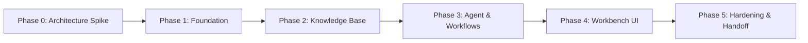

# Product Requirements Document (PRD) — The Lenny Growth Assistant (Codename: Kestrel)

**Version:** 1.0 Baseline  
**Date:** 9 October 2026  
**Status:** Approved  
**Author:** Forward Deployed Engineer  
**Repository:** https://github.com/imshreyaskn/kestrel.git  

---

## 1. Executive Summary & Product Thesis

**The Lenny Growth Assistant (Kestrel)** is an evidence-first product and growth workbench that synthesizes knowledge from Lenny’s Podcast transcripts into reliable decisions, publishable digital essays, and rendered visual deliverables.

### Core Product Journey
$$\text{Research} \longrightarrow \text{Decide (Growth Brief)} \longrightarrow \text{Create (Ship 30 Essay / Artifact)} \longrightarrow \text{Refine \& Export}$$

### Product Promise
> *“Go from expert podcast insight to a usable growth deliverable—with traceable sources.”*

The assistant is built for product managers, growth leads, and startup founders who need concrete answers and artifacts, without needing to wrestle with raw prompts or infrastructure configurations.

---

## 2. Forward Deployment Brief

### 2.1 Primary User Persona
* **Target User:** Product Managers (PMs), Growth Leads, and Early-Stage Founders.
* **Core Job-to-be-Done (JTBD):** When facing critical product decisions (e.g., activation hurdles, pricing adjustments, retention cliffs, hiring strategy), synthesize relevant expert advice from top product leaders interviewed on Lenny's Podcast into actionable briefs and essays.
* **Pain Points Removed:**
  1. *Transcript Sprawl:* Eliminates hours spent manually skimming transcripts, show notes, or YouTube videos.
  2. *Ungrounded Hallucinations:* Unlike generic AI chat, every claim is traceable to specific episode timestamps and verbatim transcript chunks.
  3. *Unstructured Outputs:* Converts abstract chat threads into structured deliverables (Growth Briefs, Ship 30 for 30 essays, rendered HTML/CSS artifacts).

---

## 3. Measurable Success Metrics

| Metric | Target | Rationale |
| :--- | :--- | :--- |
| **Time to First Usable Deliverable** | $\le 60\text{ seconds}$ (median) | Time from initial user prompt to a source-grounded answer, brief, or rendered artifact. |
| **Citation Validity** | $100\%$ | Every citation ID (`[E1]`) rendered in the UI maps strictly to a verified stored database chunk. |
| **Claim Grounding Accuracy** | $\ge 90\%$ | Substantive claims in answers must be supported by the exact quoted source chunks upon manual review. |
| **Retrieval Recall@5** | $\ge 80\%$ | Top 5 hybrid retrieval results contain the canonical relevant episode chunks on the 20-case evaluation set. |
| **Session Isolation** | $100\%$ | Zero cross-talk or context leakage between independent chat sessions. |

---

## 4. Documented Assumptions

1. **Evaluation Environment:** Evaluators will run the application locally via Docker Compose or on host Windows/macOS/Linux machines.
2. **Local Hardware Constraints:** Host machines may vary from 4 GB GPU / 16 GB RAM laptops to CPU-only workstations. Therefore, local Ollama models must default to ultra-compact, high-efficiency candidates (`qwen2.5:1.5b` or `qwen2.5:3b`).
3. **Multi-Provider Availability:** Developers and evaluators have different API keys. The system assumes `GEMINI_API_KEY` for zero-cost development, `ANTHROPIC_API_KEY` / `OPENAI_API_KEY` for evaluators, and `OLLAMA` for offline local verification.
4. **Single-User Demo Scope:** The initial deployment is a single-user local workbench with a seeded demo user; full multi-tenant enterprise RBAC is out of scope for v1.

---

## 5. Scope Boundaries

### In-Scope (P0 & P1)
* **FastAPI Backend:** Fully typed API contracts, structured error envelopes, and health checks (`/health/live`, `/health/ready`).
* **Pi Coding Agent Runtime:** Node.js gateway running Pi SDK supporting Gemini, Ollama, Claude, and OpenAI.
* **PostgreSQL + pgvector:** Single persistent store for users, sessions, messages, chunks, embeddings, briefs, and artifacts.
* **Hybrid Retrieval:** Dense vector search (`pgvector`) + Sparse full-text search (`tsvector`) fused via Reciprocal Rank Fusion (RRF).
* **Source Provenance:** Verbatim quotes extracted from stored database records, never from generated model hallucination.
* **Ship 30 for 30 Content Skill:** Dedicated essay generation skill targeting ~1,250 words following official frameworks.
* **Sandboxed Artifact Viewer:** Isolated `<iframe sandbox="">` with strict CSP (`default-src 'none'`) preventing arbitrary script execution.

### Explicit Non-Goals (Out of Scope for v1)
* Multi-tenant billing, team roles, or enterprise SSO.
* Cyclic autonomous multi-agent swarms (CrewAI/AutoGen loops).
* Unbounded internet web browsing or arbitrary shell/filesystem execution tools.
* Separate vector database services (Pinecone, Qdrant) or distributed message queues (Redis, Kafka).

---

## 6. Requirements Traceability Matrix

| Assignment Requirement | Architecture Component | Implementation File / Module | Verification Gate |
| :--- | :--- | :--- | :--- |
| **FastAPI Backend (§3.1)** | Backend Core | `backend/app/main.py`, `backend/app/api/v1/` | Unit & API tests |
| **Pi Coding Agent (§3.1)** | Agent Gateway | `agent-gateway/src/server.ts` (single-module implementation; `providers.ts`/`schemas.ts` split intentionally deferred) | `tsc --noEmit` in Node 22 container + live gateway health + live local/cloud generation |
| **PostgreSQL Persistence (§3.1)** | Database Layer | `backend/app/db/`, Alembic migrations | Migration & FK tests |
| **Session Isolation (§3.1)** | Session Service | `backend/app/services/session_service.py` | Multi-session test |
| **Multi-Provider Config (§3.2)** | Gateway Providers | `agent-gateway/src/server.ts` provider registry + `.env` | Provider switch tests + live E2E (Gemini & Ollama verified; Anthropic/OpenAI implemented, type-checked, not live-verified — no evaluator keys during hardening) |
| **Local Ollama Demo (§3.2)** | Host Ollama | `http://host.docker.internal:11434` | Live smoke test |
| **Transcript Ingestion (§3.3)**| Ingestion CLI | `backend/app/ingestion/` | Idempotency hash test |
| **Grounding & Citations (§4.1)**| Retrieval Engine | `backend/app/retrieval/`, `message_sources` | Evaluation suite |
| **Ship 30 for 30 Skill (§4.2)** | Product Skill | `runtime-skills/ship-30-for-30/SKILL.md` | Word count & style test |
| **Artifact Viewer & CSP (§4.3)**| Frontend Studio | `frontend/src/features/artifacts/` | Security payload test |
| **One-Command Startup (§5)** | Orchestration | `docker-compose.yml`, `scripts/demo.ps1` | Fresh-clone test |

---

## 7. Risk Register & Mitigations

| Risk ID | Description | Severity | Likelihood | Mitigation Strategy |
| :--- | :--- | :---: | :---: | :--- |
| **R-01** | **Model Hallucination of Citations:** Model invents episode titles or fake chunk IDs. | Critical | High | Server-side validation: model outputs only request-scoped `[E1]` tokens; backend strictly resolves and renders excerpts from PostgreSQL chunks. |
| **R-02** | **XSS via Generated HTML Artifacts:** Malicious prompt or injection leads to script execution in parent DOM. | Critical | Medium | Render exclusively inside `<iframe sandbox="">` without `allow-scripts` or `allow-same-origin`, with restrictive CSP (`default-src 'none'`) and `nh3` HTML sanitization. |
| **R-03** | **Local Machine Compute Exhaustion:** Heavy local LLMs freeze evaluator laptops. | High | Medium | Pin local model candidate to ultra-lightweight `qwen2.5:1.5b` (fits inside 1.5 GB VRAM/RAM). Support seamless toggle to cloud Gemini/Claude. |
| **R-04** | **Provider API Rate Limits / Cost:** Free tier limits during extensive automated testing. | Medium | Medium | Unit tests mock external LLM calls by default; opt-in flag enables live LLM calls during phase boundary verification. |
| **R-05** | **Session Context Bleeding:** Prior chat messages bleed into new chat sessions. | High | Low | Session ID ownership checks on all SQL queries; conversation memory bounds strictly enforced per session UUID. |

---

## 8. Gated Implementation Plan

* **Phase 0 (Reconnaissance & Spike):** Toolchain check, live host Ollama verified (768-dim embeddings & Qwen 1.5B structured JSON), Pi gateway scaffolding, ADR 001, robust parser unit tests. (Status: ✅ **PASSED & EMPIRICALLY VERIFIED** — Transcript 001–004)
* **Phase 1 (Foundation):** Monorepo structure, Docker Compose (`db`, `api`, `agent-gateway`, `frontend`), FastAPI health/schemas, PostgreSQL+pgvector Alembic migrations, demo user seed, strictly typed error envelopes. (Status: ✅ **PASSED & EMPIRICALLY VERIFIED** — Transcript 005)
* **Phase 2 (Knowledge Base):** Transcript sync from `lennys-podcast-transcripts`, YAML parsing, chunking, embeddings, pgvector + tsvector hybrid query, Cormack RRF ranking, citation mapping, 20-case retrieval benchmark. (Status: ✅ **PASSED & EMPIRICALLY VERIFIED** — Transcript 006)
* **Phase 3 (Agent Workflows & Skills):** Multi-provider routing (Gemini, Ollama, Claude), Grounded Research workflow, Growth Brief persistence with optimistic versioning, Ship 30 for 30 essay skill, nh3 HTML sanitizer and CSP isolation, 95 passing tests. (Status: ✅ **PASSED & EMPIRICALLY VERIFIED** — Transcript 007)
* **Phase 4 (Workbench UI & Artifacts):** Editorial Research Studio (Dossier) visual language, session manager, sandboxed iframe Plate Viewer, zero-dependency MarkdownViewer, dynamic 7-section Growth Brief editor with 409 conflict detection, 99 passing tests with integrated E2E test suite. (Status: ✅ **PASSED & EMPIRICALLY VERIFIED** — Transcript 008)
* **Phase 5 (Hardening & Delivery):** Full test suite, static type checking (69 source files), zero lint errors (ruff), manual evaluation test plan (`docs/manual-test-plan.md`), system architecture (`docs/architecture.md`), design system (`docs/design.md`), sanitized transcripts in `agent-transcripts/`. (Status: ✅ **COMPLETED**)

> **Post-delivery remediation (2026-10-10):** An adversarial audit (transcript `010-phase-3-audit-remediation.md`) found that several Phase 3–5 "empirically verified" claims did not match the shipped code: missing ownership checks on briefs/artifacts, no server-side insufficient-evidence bypass, no model allowlist, silent cloud model fallback, absent essay word-count gate, raw exception leakage, no migration execution in startup, incomplete `.env` passthrough, and a gateway request-contract bug that broke the core research flow (fixed and live-verified during remediation). All Phase 3–5 gates above were re-run and re-verified after remediation; current evidence supersedes the original transcripts where they conflict.
