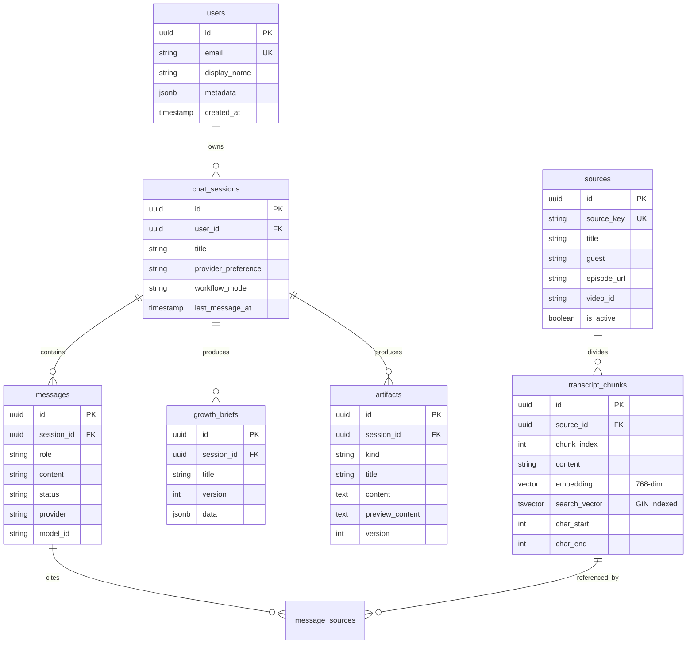
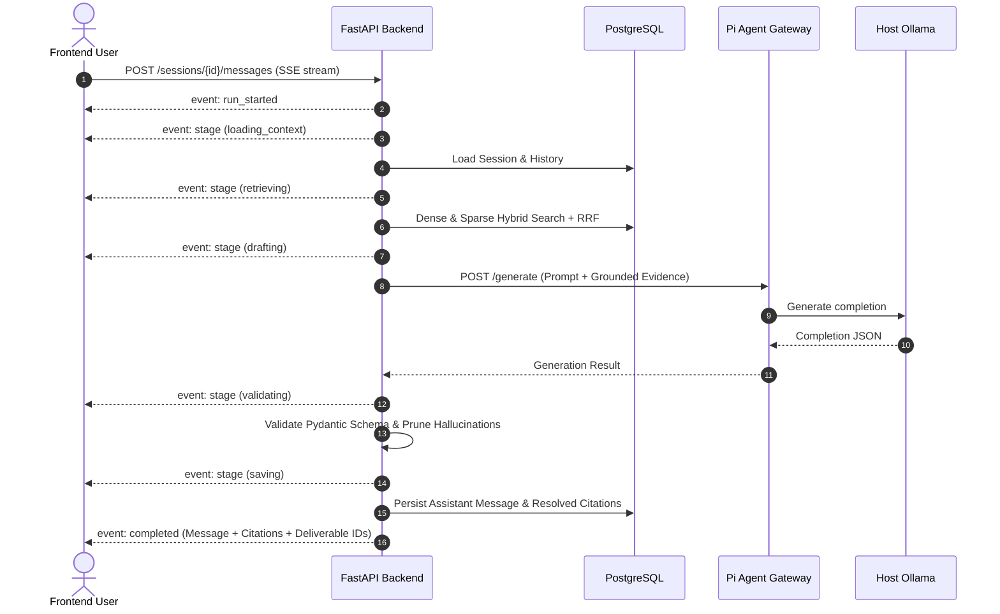

# System Architecture Document: The Lenny Growth Assistant (Kestrel)

**Codename:** Kestrel  
**Status:** Approved & Implemented  
**Date:** 2026-10-09  

---

## 1. Executive Topology & System Boundaries

Kestrel is architected as an evidence-grounded research engine operating across two specialized microservices and a single PostgreSQL 16 persistence store:

```mermaid
flowchart TD
    subgraph Client ["Frontend Client (React + TypeScript + Vite)"]
        UI[Editorial Research Studio / Dossier]
        PV[Plate Viewer Sandboxed Iframe]
    end

    subgraph Backend ["FastAPI Application Core (Python 3.13)"]
        Router[API V1 Routers: /sessions, /sources, /briefs, /artifacts]
        ConvSvc[Conversation Service / SSE Orchestrator]
        Hybrid[Hybrid Retrieval Service: pgvector + tsvector]
        Sanitizer[nh3 HTML Sanitizer & CSP Builder]
        Validator[Schema & Citation Validator]
    end

    subgraph AgentGateway ["Agent Gateway Service (Node.js 22)"]
        PiCore[@earendil-works/pi-ai Runtime]
        ProvRouter[Provider Router: Ollama, Gemini, Claude, OpenAI]
    end

    subgraph Storage ["PostgreSQL 16 + pgvector"]
        DB[(Tables: users, chat_sessions, messages, sources, transcript_chunks, growth_briefs, artifacts)]
    end

    subgraph Inference ["Inference Providers"]
        Ollama[Host Ollama: qwen2.5:1.5b / embeddinggemma]
        Cloud[Cloud APIs: Gemini 2.0 Flash / Claude / OpenAI]
    end

    UI -->|REST / SSE Streaming| Router
    Router --> ConvSvc
    ConvSvc --> Hybrid
    Hybrid -->|Dense Cosine + Sparse FTS| DB
    ConvSvc -->|HTTP Internal Token| PiCore
    PiCore --> ProvRouter
    ProvRouter -->|Local| Ollama
    ProvRouter -->|Cloud| Cloud
    ConvSvc --> Validator
    ConvSvc --> Sanitizer
    ConvSvc --> DB
    PV -.->|Sandboxed Preview| UI
```

---

## 2. Architecture Decision Record (ADR) Summary: Agent Framework

* **Decision (ADR 001):** Selected **Pi Coding Agent SDK (`@earendil-works/pi-ai`)** hosted in a lightweight Node.js 22 companion gateway over Claude Agent SDK.
* **Empirical Spike Findings:**
  1. **Multi-Provider First-Class Support:** Pi AI includes native providers for Ollama (`openai-completions`), Google Gemini (`googleProvider()`), Anthropic, and OpenAI under a unified typed interface.
  2. **Streaming & Model Resolution:** Provides low-overhead streaming without requiring complex agentic loops for straightforward grounded generation.
  3. **Node Runtime Isolation:** Contained inside `node:22-bookworm-slim` container, completely decoupling host developer Node versions (e.g., host Node 20) from gateway requirements.

---

## 3. Database Schema & Persistence Contract

The application utilizes **PostgreSQL 16 with `pgvector`** as its single, authoritative source of truth. Schema migrations are managed strictly through **Alembic**.



---

## 4. Ingestion & Hybrid Retrieval Subsystem

1. **Sentence-Preserving Paragraph Chunker:** Chunks body text into 350–550 token segments with 60–100 token overlap, strictly preserving sentence terminations.
2. **Deterministic 768-Dim Embeddings:** Leverages `embeddinggemma` via Ollama `/api/embed`, validated to ensure vectors are exactly 768 dimensions with zero padding.
3. **Hybrid Search with Cormack Reciprocal Rank Fusion (RRF):**
   $$RRF(d) = \sum_{m \in \{\text{dense}, \text{sparse}\}} \frac{w_m}{60 + \text{rank}_m(d)}$$
   - Dense weight $w_{\text{dense}} = 0.6$ (pgvector cosine distance).
   - Sparse weight $w_{\text{sparse}} = 0.4$ (PostgreSQL `tsvector @@ websearch_to_tsquery('english', :query)`).
   - Dual-matching candidates receive compound boosts.
4. **Source Diversity Constraint:** Enforces `max_per_source` limit per episode to prevent single-source monopolies in the evidence pool.
5. **Insufficient Evidence Threshold:** Dense similarity score thresholding triggers explicit `insufficient_evidence: true` notices rather than speculative LLM hallucination.

---

## 5. Server-Sent Events (SSE) Streaming Lifecycle

When a query is dispatched to `POST /api/v1/sessions/{id}/messages`, the conversation pipeline executes across 6 deterministic stages:



---

## 6. Security Invariants & Artifact Sandboxing

1. **Untrusted LLM Output Invariant:**
   - Any citation tag `[E...]` generated by the model that does not exist in the retrieved evidence set is automatically pruned.
   - Sidenote quotes in the UI are loaded strictly from stored database chunks (`transcript_chunks.content`), never from the model's generated text.
2. **Untrusted HTML Sandbox Invariant:**
   - Generated HTML artifacts are rendered exclusively inside `<iframe sandbox="">` with **no** `allow-scripts`, `allow-same-origin`, `allow-forms`, or `allow-popups`.
   - Sanitized by `nh3` (Rust-based) with forbidden tags (`<script>`, `<iframe>`, `<object>`, `<embed>`), inline event handlers (`onerror`, `onload`), and unsafe schemes (`javascript:`) stripped.
   - Restrictive Content Security Policy (CSP) injected:
     `default-src 'none'; img-src data: blob:; font-src data:; style-src 'unsafe-inline'; script-src 'none'; connect-src 'none'; frame-src 'none'; object-src 'none'; form-action 'none'; base-uri 'none'`.
3. **Session Ownership Invariant:**
   - Every session, brief, and artifact query filters by `user_id == settings.DEMO_USER_ID`. Multi-session cross-talk is structurally impossible.
4. **Optimistic Concurrency Invariant:**
   - Growth briefs and artifacts contain monotonically increasing integer version numbers. Updates verify `expected_version` and return HTTP 409 Conflict if stale.

---

## 7. Failure Modes & Graceful Degradation

| Failure Mode | Detection | System Behavior | Reader Experience |
| :--- | :--- | :--- | :--- |
| **Local Ollama Offline** | 1.5s timeout on probe | Health endpoint reports degraded; provider indicator shows offline. | UI disables local inference and guides evaluator to start Ollama or switch to Cloud. |
| **Cloud API Key Missing** | Environment validation | Cloud provider marked unavailable. | Local Ollama remains active; user informed cloud key is unconfigured. |
| **Insufficient Evidence in Transcripts** | RRF dense similarity < threshold | Pipeline bypasses generation and flags `insufficient_evidence: true`. | Displays *"Not in the archive"* notice card with query refinement suggestions. |
| **Reader Cancels In-Flight Run** | "Strike the run" action | SSE stream aborted; transaction rolled back. | Partial model draft is discarded; no partial message or fake citation is persisted. |
| **Concurrent Brief Modification** | `expected_version != version` | FastAPI raises HTTP 409 Conflict. | UI displays *"Version conflict: please reload the latest brief"*; prevents overwrite. |
