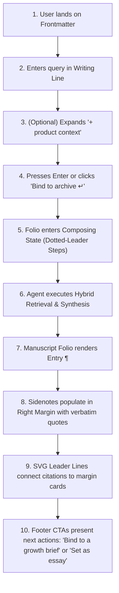
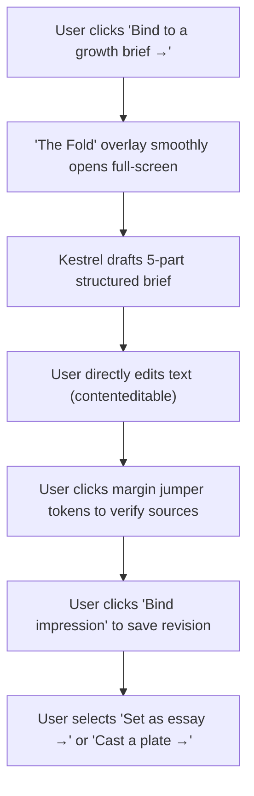
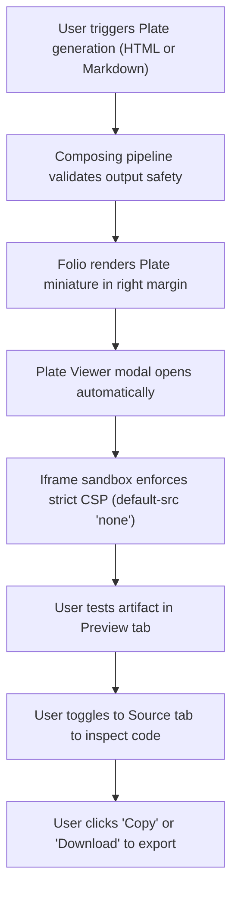

# Kestrel User Journeys & Interaction Blueprints

**Status:** Canonical Ground Truth for UX Workflows  
**Target Personas:** Product Managers (PMs), Growth Leads, Early-Stage Founders  
**Companion Documents:** `DESIGN_SPEC.md`, `kestrel-dossier-prototype.html`

---

## 1. Persona Matrix & Core Needs

| Persona | Primary Goal | Context & Mindset | Biggest Pain Point |
| :--- | :--- | :--- | :--- |
| **Growth Lead** (e.g., Series A B2B SaaS) | Unblock a stalling funnel (e.g. activation, onboarding drops, pricing resistance). | Needs battle-tested benchmarks and frameworks from operators who have actually solved this. | Generic AI gives hallucinated, generic "best practices" without credible proof or real context. |
| **Product Manager** (e.g., Growth PM / Core PM) | Turn research into a concrete, reviewable experiment plan. | Needs to write a brief with problem, metrics, hypothesis, and decision rules. | Blank-page friction; difficulty translating high-level podcast advice into a structured experiment. |
| **Founder / Operator** | Publish a thought-leadership essay or internal strategy memo. | Needs a skimmable, compelling narrative based on expert consensus. | Needs structure like Ship 30 for 30 (hook, 1-3-1 cadence, takeaways) without sounding like generic marketing fluff. |

---

## 2. Journey A: "Research a Problem" (The Core Ingestion & Folio Flow)

### 2.1 Trigger
A PM notices that new signups drop off sharply before completing their first project. They want to know what growth leaders interviewed by Lenny advise regarding activation vs. retention.

### 2.2 Step-by-Step UX Blueprint

### 2.3 Interaction Details
1. **Entry:** User types: *"How can an early-stage SaaS improve activation without hurting retention?"*
2. **Context Distinction:** If the user adds product context (*"400 self-serve trials a month, 23% week-1 completion"*), this is visually rendered with a distinct grey rule and stamp labeled `User context`—never as a cited podcast fact.
3. **Execution Feedback:** During generation, user sees 4 progressive stages:
   - `consulting the archive` (semantic + keyword · 8 passages weighed)
   - `drafting the entry` (grounded in retrieved passages only)
   - `verifying citations` (each claim checked to its source)
   - `binding to the session`
   - *Patience control:* User can click `strike this run` at any second to discard the generation without saving partial drafts.
4. **Resolution:** The folio displays:
   - Numbered paragraph `¶ 1`.
   - Editorial drop-cap leading paragraph.
   - 4 verified claims with superscript markers `[1]`, `[2]`, `[3]`, `[4]`.
   - Right margin populates with cards for **Rahul Vohra** (Superhuman), **Casey Winters** (Retention advisor), **Jorge Mazal** (Duolingo), and **Elena Verna** (PLG advisor).
   - Dynamic SVG leader lines trace across the gutter.

---

## 3. Journey B: "Compose a Growth Brief" (The Decision Flow)

### 3.1 Trigger
Having reviewed expert perspectives, the PM needs to synthesize the advice into an actionable decision brief for their product team.

### 3.2 Step-by-Step UX Blueprint

### 3.3 The 5 Sections of The Growth Brief
1. **Section I: Problem (User Context)**  
   *Pre-filled from optional context or user query.* Explains the current state, baseline metrics, and primary goal.
2. **Section II: Research & Evidence (Transcript Evidence)**  
   Key tenets extracted directly from the podcast interviews. Includes clickable jumper pills `[1]`, `[2]` that instantly scroll the folio underneath to the verbatim quotes.
3. **Section III: Recommendation & Synthesis (Assistant Synthesis)**  
   Actionable direction (e.g., guided template gallery) paired with explicit **Assumptions & limitations**.
4. **Section IV: Experiment Specification**  
   Clean tabular definition:
   - *Hypothesis*
   - *Change*
   - *Audience & Split*
   - *Primary Metric & Baseline*
   - *Guardrail Metrics*
   - *Decision Rule (Ship / Iterate / Revert criteria)*
5. **Section V: Next Deliverable**  
   Action buttons to convert this brief into an external essay or visual plate.

---

## 4. Journey C: "Create Content — Ship 30 for 30 Essay" (The Publishing Flow)

### 4.1 Trigger
The founder or growth lead wants to turn the synthesis from the brief into a publishable ~1,250-word digital essay following the proven Ship 30 for 30 writing framework.

### 4.2 Framework Implementation
* **Word Count Target:** ~1,250 words.
* **Cadence & Rhythm:**
  - Hook: 1 sentence that challenges conventional wisdom.
  - 1-3-1 cadence (short punchy sentences alternating with 3-sentence explanatory paragraphs).
  - Skimmable headers and bold lead-ins for every key idea.
  - Practical, tactical takeaway at the conclusion.
* **Provenance Invariant:** Every central thesis statement cites its origin in Lenny's archive.

### 4.3 Interaction Blueprint
1. In the Growth Brief or Folio footer, user clicks **"Set as an essay →"**.
2. Composer mode switches to **Essay** with a pre-filled prompt:  
   *"Write a Ship 30-style essay (~1,250 words) arguing that activation improves when you narrow the first run to one personally meaningful outcome. Ground every claim in this session’s sources."*
3. Generation follows standard verified stages (`consulting archive` → `outlining` → `drafting` → `verifying`).
4. Output is typeset directly into the dossier or exported as a Markdown artifact.

---

## 5. Journey D: "Cast a Plate" (The Visual Deliverable Flow)

### 5.1 Trigger
The team needs a visual artifact—either a standalone one-page HTML experiment brief or an interactive calculator—to share in an executive review or embed in internal documentation.

### 5.2 Step-by-Step UX Blueprint

### 5.3 Security & Sandbox Invariant
* **Isolation:** All generated HTML is rendered inside `<iframe sandbox="">` with `style-src 'unsafe-inline'` and `default-src 'none'`.
* **Zero Script Execution:** Scripts, forms, top-level navigation, and external connections are strictly blocked.
* **Refinement:** The user can click **Revise** at any time to feed feedback back into the composer without losing the original version.

---

## 6. The Non-Negotiable UX Edge Cases

1. **The "Outrunning the Evidence" Case (Zero / Insufficient Retrieval)**
   - *Trigger:* User asks for a metric not reliably discussed in the podcast (e.g. *"What is the average PLG conversion rate for Series B FinTechs?"*).
   - *UX Response:* System **never** fabricates a statistic or fills in outside general model knowledge. It renders a clean advisory notice: *"Not in the archive: I searched the episode index for benchmark conversion rates, and the archive can't support a reliable answer. I’d rather show you the gap than invent a figure."* Suggests actionable pivots.
2. **The "Model Unreachable" Case (Local Ollama Offline)**
   - *Trigger:* Host Ollama daemon is not running or out of memory.
   - *UX Response:* Never silently fall back to cloud. Colophon presents a clear, polite dialog: *"Local model offline. Retry local connection or switch to Gemini Cloud?"*
3. **The "Interrupted Train of Thought" Case (Mid-run Cancellation)**
   - *Trigger:* User hits `strike this run`.
   - *UX Response:* Immediate halt. Clear message that partial draft was discarded and nothing was persisted to database.
